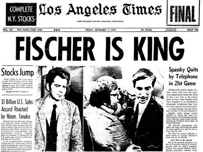

<b>Source :</b> <a href="https://en.chessbase.com/">https://en.chessbase.com/</a> 
<i>© 2017 Chessbase GmbH</i> parties (format PGN) : <i>© <a href="http://theweekinchess.com/">PGN Mentor</a> © 2016 64 Squares</i> &nbsp;
 &nbsp;

* [**01**](https://www.evernote.com/shard/s122/sh/50e0693d-f1da-4d0e-8431-dbf82f48a636/fe646daa465137b94982d86c4915c947) : Bobby Fischer arrives in Iceland
* [**02**](https://www.evernote.com/shard/s122/sh/16f9935a-c031-4fd4-b7cd-c10e1d718609/ab68b3bf008f3558cf546a335b6e53e4) : Laugardalshöllin
* [**03**](https://www.evernote.com/shard/s122/sh/dac64137-80b1-43da-aa13-d2b884a2192a/2b7476b995c0a741e3931061c9a4b3c2) : The drama of game one
* [**04**](https://www.evernote.com/shard/s122/sh/6b7a0ce7-5daa-41ee-a260-eaced636ba9a/fee75991305ad7079f26c6eb6b306144) : Chess in the ping-pong room
* [**05**](https://www.evernote.com/shard/s122/sh/6d9a39b3-6324-4a82-a27d-253ff422b8ff/2ec67235d8a7d2704bf2b21e2bb3e579) : The move times recorded

 "LCC 2017 Games (PGN format)")](1972.pgn) pour télécharger les parties du match  `PGN - 15kb`

