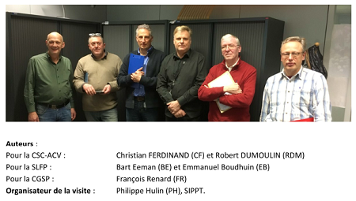

## PV du CCB1 du 15.09.2014

* [Debriefing](CCB1_20140915_Debriefing.pdf) rédigé le 17.09.2014
* procès-verbal [FR](PV_CCB1_20140915_FR.pdf) - [NL](PV_CCB1_20140915_NL.pdf)

## Documents reçus de Ph. Hulin

### en 2014

* [Bureau 5/A19](5A19_avis_2014.pdf)
    * à l'époque occupé par Mme Pereira Dos Santos et M. Libioulle
    * présumé en 2017 "convenir" à 3 agents !!! ([page 45/96](p45.pdf) du reportage de Christian)
    * en 2018 : toujours partagé par 2 agents

### en 2017

* [Doc1](Doc1.pdf) - Avis du 25.11.2013 sur les lieux de travail
* [Doc2](Doc2.pdf) - Avis du 07.12.2017 (analyse de risques incendie)
* [Doc3](Doc3.pdf) - "normes" utilisables pour les lieux de travail (2012)
* [surfaces des bureaux du 6ème étage](Atrium_Et6_superficies.pdf)
* [6ème étage - Aile de l'ABC](ABC_nombre_occupants.pdf) : nombre d'occupants par bureau

## Code du travail

* Version consolidée au [12.06.2017](code2017.pdf)

## Notes de visite

> La visite en accompagnement du SIPPT a eu lieu le 04.01.2018, de 10h30 à 12h50

  
*Couverture du projet Alpha (05.01.2018) de Christian*

* [Découpe du projet en 2 plaquettes](Mail_20180106.pdf) - explications fournies le 06.01.2018 à propos du projet *Alpha* de Christian
